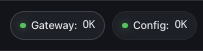

# Openclaw - Claw Cast Plugin

Give your Openclaw agents a face! Claw Cast enables a real time video avatar for any of your Openclaw agents. Now you can speak directly with your agent and bring them anywhere on your desktop!

Claw Cast is an OpenClaw plugin that integrates LemonSlice, LiveKit, and ElevenLabs to deliver a real-time avatar experience with plugin-managed setup, browser session controls, text chat, speech-to-text, and text-to-speech.

<div>
  <a href="https://www.loom.com/share/307a34384a0b4dc4a5391d8bbc9accf7">
    <p>Claw Cast Demo - Watch Video</p>
  </a>
  <a href="https://www.loom.com/share/307a34384a0b4dc4a5391d8bbc9accf7">
    
  </a>
</div>

**Outline**

- [Prerequisites](#prerequisites)
- [Install](#install)
- [Configure](#configure)
- [Join avatar session](#join-avatar-session)
- [Usage tips](#usage-tips)
- [Update](#update)
- [Public Interface](#public-interface)
- [Package Contents](#package-contents)
- [About The Install Warning](#about-the-install-warning)
- [Verification/testing](#verification-testing)
- [License](#license)

<a id="prerequisites"></a>
## Prerequisites

### OpenClaw

Before installing and running this plugin **you must have an OpenClaw instance installed and configured**

- OpenClaw [install guide](https://docs.openclaw.ai/install#npm-pnpm)

After installing, make sure you have configured at least one LLM provider.
We **highly recommend** using a fast LLM model for a better experience. Examples below.
- qwen3-30B-A3B
- gpt-5-nano
- claude-haiku-4-5

```bash
openclaw config
```
After configuring a valid LLM provider, make sure your agent is set up with a primary model.
```text
http://127.0.0.1:18789/agents
 ```

### Providers

You will also need accounts with the following service providers:

- **LemonSlice** — provides the avatar/character rendering for the video chat experience.
  Sign up at https://www.lemonslice.com

- **ElevenLabs** — powers plugin-owned speech-to-text (STT) and text-to-speech (TTS).
  Sign up at https://elevenlabs.io

- **LiveKit** — provides the real-time video/audio room infrastructure.
  Sign up at https://livekit.io

- **Publicly Accessible Image URL** - The source image for the avatar.
  UploadThing is a convenient way to store images with publicly accessible URLs. https://uploadthing.com/

Once you have accounts, retrieve API keys from each service and supply them during plugin setup.

<a id="install"></a>
## Install

Plugin installation:

```bash
openclaw plugins install openclaw-video-chat-do-not-install-7f3c9d1@latest
openclaw plugins enable video-chat
openclaw plugins list
```

Verify that ClawCast is listed. 

<a id="configure"></a>
## Configure

The plugin can be configured with either the CLI (reccomended) or web browser interface. If you choose to use the web interface you must first [run the OpenClaw gateway](#run-gateway).

### CLI Config 

```bash
openclaw video-chat-setup
```

### Browser Config

1. [Run the gateway](#run-gateway)
2. [Open the plugin UI](http://127.0.0.1:18789/plugins/video-chat/config)
3. Set gateway token, click "Use Token"
4. Set provider values, click "Save"

Browser Config link
```text
http://127.0.0.1:18789/plugins/video-chat/config
```

**Once the plugin is properly configured the Gateway and Config status indicators (top bar of plugin web UI) will read "OK" and show green lights.**



<a id="run-gateway"></a>
### Run Gateway

Start

```bash
openclaw gateway run
```

If the gateway is currently running, it can be stopped by using:

```bash
openclaw gateway stop
```

The gateway can also be forcefully re-run:

```bash
openclaw gateway run --force
```

<a id="join-avatar-session"></a>
## Join avatar session
Start a session, join the room, and use the chat, STT, and TTS controls from the web interface.
```text
http://127.0.0.1:18789/plugins/video-chat/
```
Plugin documentation is also available in the web UI at:
```text
http://127.0.0.1:18789/plugins/video-chat/readme
```
If you choose to use the picture-in-picture view for the avatar, do not close the avatar tab.

Session key tips:

- Leave the Session key field blank, or enter `main`, to use the default OpenClaw session key from `session.mainKey` (fallback: `main`).
- Enter a plain key like `research` if that is the session name you started in OpenClaw.
- For the default OpenClaw main agent, the fully qualified agent session key format is `agent:main:<sessionKey>`, for example `agent:main:main`.
- If OpenClaw already shows a full agent session key, paste it into the field exactly as-is.

<a id="usage-tips"></a>
## Usage tips

- The plugin is best used in a Chromium-based browser.

Best image sizes:

| aspect_ratio | resolution |
|--------------|------------|
| 2x3          | 368×560    |
| 3x2          | 560×368    |
| 9x16         | 336×608    |
| 16x9         | 608×336    |

<a id="update"></a>
## Update

The plugin can be updated to the latest version using:

```bash
openclaw plugins update video-chat  
```

<a id="public-interface"></a>
## Public Interface

- Gateway methods:
  - `videoChat.config`
  - `videoChat.setup.get`
  - `videoChat.setup.save`
  - `videoChat.session.create`
  - `videoChat.session.stop`
  - `videoChat.audio.transcribe`
  - `videoChat.tts.generate`
- HTTP routes:
  - `/plugins/video-chat`
  - `/plugins/video-chat/config`
  - `/plugins/video-chat/readme`
  - `/plugins/video-chat/api/*`
  - `/plugins/video-chat/assets/*`
  - `/plugins/video-chat/styles/*`
- Service:
  - `video-chat-agent`
- CLI command:
  - `video-chat-setup`

<a id="package-contents"></a>
## Package Contents

- Gateway extension: `video-chat/index.ts`
- Sidecar helpers:
  - `video-chat/video-chat-agent-bridge.mjs`
  - `video-chat/video-chat-agent-runner-wrapper.mjs`
  - `video-chat/video-chat-agent-runner.js`
  - `video-chat/sidecar-process-control.ts`
- Web UI:
  - `web/index.html`
  - `web/readme.html`
  - `web/settings.html`
  - `web/app.js`
  - `assets/`
  - `styles/`
- Plugin manifest: [`openclaw.plugin.json`](openclaw.plugin.json)

`package.json` uses a `files` allowlist so `npm pack` only includes the runtime files above and excludes tests, local dependencies, and editor artifacts.

<a id="about-the-install-warning"></a>
## About The Install Warning

OpenClaw may show a warning like this during install:

```text
WARNING: Plugin "video-chat" contains dangerous code patterns: Shell command execution detected (child_process) (.../video-chat/index.ts:1727); Environment variable access combined with network send — possible credential harvesting (.../video-chat/index.ts:212)
```

That warning is expected for this plugin. It is flagging two real implementation details:

- `child_process` in `video-chat/index.ts` is used to start a local sidecar worker for the `video-chat-agent` service. That worker runs the long-lived LiveKit agent runtime in a separate process so it can be started, stopped, restarted, and isolated from the main gateway process.
- `process.env` plus network activity in `video-chat/index.ts` is used to read setup defaults and plugin-specific runtime variables, then connect to the local OpenClaw gateway and the configured LiveKit, ElevenLabs, and LemonSlice services that power the plugin.

What this plugin is not doing:

- It does not execute arbitrary shell snippets from user input.
- The plugin does not scan unrelated environment variables and send them to a third-party endpoint.
- Outbound connections are limited to the services required for the video chat flow and the local OpenClaw gateway bridge.

What it does do:

- Launch a local worker process for the avatar agent runtime.
- Read the plugin's configured credentials, and optionally specific documented environment variables, to supply those services.
- Send audio, transcript, and session traffic only to the configured providers needed for Claw Cast to function.

<a id="verification-testing"></a>
## Verification/testing

Release validation is codified in the project scripts:

```bash
npm run typecheck
npm test
npm run pack:check
npm run validate
```

Current automated coverage includes:

- gateway method registration and request validation
- plugin-owned config overlay behavior
- HTTP route serving for the shipped UI/API entry points
- sidecar process-group shutdown and reset behavior
- TTS and STT integration points through the plugin runtime mock

<a id="license"></a>
## License

This project is licensed under the MIT License. See [LICENSE](LICENSE) for details.
